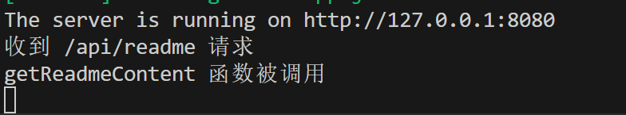

# 这里是学习心得

## 个人学习心得

> 我从大一开始决定做前端方面的工作，是因为加入实验室的前端组。刚进入还不知道前端是什么，一窍不通。但是在自己第一次做出页面，到独立承接学院网站的改版开发，中间的成就感很大，我对web开发有了浓烈的兴趣，后来在慢慢的学习中发现其实没有那么简单，但是反馈十分明显，都是在页面上能显示出来，偶尔会有点枯燥，但是总体还是坚持下来了，这一次的训练营学习到了更多实践方面，希望能够继续加油！
>

## 感悟

基础学习：`HTML+CSS+JavaScript    `    TypeScript

框架学习：`vue `   ` React`   等

工具学习：

```
vite   webpack  git   koa  SQLite   tailwind CSS   Eslint    Prettier
```

第三方组件/插件等

## 

感悟内容大概

| 序号 | 感悟内容                                                     |
| ---- | ------------------------------------------------------------ |
| 1    | JavaScript 基础知识至关重要，尤其 React 对 JS 原生要求高，需多练多用。 |
| 2    | TypeScript 的静态类型检查可提升代码稳定性和可维护性，减少运行时错误。 |
| 3    | 前端工程化知识面重要，包括团队项目规范、代码构建打包压缩等。 |
| 4    | 性能优化需注重代码封装、复用性、文件结构合理性、页面拆分等。 |
| 5    | 学会使用 AI 可快速生成基础代码结构、检查代码问题并给出优化建议。 |
| 6    | 前端学习知识点多且杂，技术更新快，需持续学习。               |

### 1.js基石的重要性

在训练营课程过程中，再一次意识到js基础**重中之重**

不管是使用框架还是组件插件，都必须能**熟知js原理**，特别是用的最多的React框架，比Vue更原生，对js原理有一定要求

另外在一些作业和考试中，发现js**一段时间不写就容易忘**，如果有工具的话还好，但当遇到一些需要js原生写法,会反应不过来

必须多练多用

### 2.TS的优势

支持静态类型检查，在编码阶段就能发现类型不匹配等错误，提升代码的稳定性和可维护性，减少线上运行时错误。

比如在定义函数参数和返回值类型后，编译器会检查调用时的类型是否正确。在参加金山训练营之前其实没有用ts做过完整的项目，所以对于ts的优势也一直没怎么体会过，不过在几次作业中，我使用ts，确实比js严格的多，避免一些项目能够运行，却发现功能抽疯，控制台不报错，去找错误找半天。

不过这也带来一些成本，在写代码的时候有一些传递的参数我需要不同的类型，这个时候需要自己去进行处理或者转化，但自己写的时候经常忘记，所以经常要再次修改

总结就是，要多用，争取熟悉使用。

### 3.前端工程化

其实在之前做过一点项目，写完代码往github上直接push就没了，在老师讲之前，完全没有考虑过在公司的团队项目规范，包括feat:前缀之类的

我认为这是很有用的一个知识面

还包括使用工具对代码构建打包压缩

### 4.性能的优化

在之前对性能的优化只是仅仅局限于页面反应速度怎么样，在课程中知道了**不要堆屎山**是重中之重，

在写作业中慢慢习惯对组件和工具函数的抽离，认真考虑我的代码能不能**尽量去复用**，我的**文件结构**别人能不能一下看懂，

我的**页面拆分**开，这样哪个负责这个功能直接定位。

虽然刚开始写的时候感觉状态传来传去，有的时候还会用到状态管理库，似乎变麻烦了，但是其实在调试功能更改错误的时候能省不少事，也就只有开始的时候要仔细思考怎么传递怎么组件化怎么封装，越到后面越方便！**最好的优化要在一开始**！

在性能的优化真的学习到了很多，不止是**代码的封装，可扩展性，健壮性**，

还有就是在做作业过程中思考怎么样能让页面给用户更快更舒适的服务，这也收获颇多，包括**数据的缓存，虚拟dom减少重复渲染，减少不必要的状态管理**等等。

虽然现代浏览器引擎已经能够很快的处理了，但是不短优化下来，特别是在浏览器工具里看到自己页面的性能评估更好，页面体验更好，会有很大成就感。在小的项目里或许这样的优化在强大的浏览器处理下感觉不出什么，但是大一点项目会迅速的很明显。

### 5.AI使用

在前端开发里，学会怎么用AI真的很重要。比如，利用AI代码生成工具，能快速生成一些基础代码结构，像表单组件、导航栏等的代码框架，节省开发时间。而且，AI的智能代码分析功能，可以帮我们检查代码中的潜在问题，给出优化建议，比如提示更高效的算法实现方式、更合理的代码布局等。另外，在用户交互方面，借助AI驱动的聊天机器人集成到前端页面，能实时响应用户问题，提供个性化服务，提升用户体验。不过目前在使用过程中，也发现AI生成的代码有时不完全符合实际业务需求，还需要人工进一步调整和完善。
除了可以加快开发速度，ai还可以让我**快速学会使用一个工具或者运用一个知识点**，特别是更新迭代很快的前端，需要快速不断的学习，ai降低了很多学习时间和学习成本

### 6.前端知识很多

前端学习知识真的很多，虽然公司里的技术栈不会那么频繁更新，但是不加紧学就感觉要被淘汰了，但是其实旧的知识也不是学完就会了，有很多很杂的内容，总是会在用到的时候发现自己得搜，总之，前端学习哪怕都在说很简单，但是真的好多啊。


## 遇到的困难

困难一览

| 序号 | 困难内容                                                     |
| ---- | ------------------------------------------------------------ |
| 1    | 配置问题令人头疼，如 ESLint 规则冲突、与 Prettier 集成不一致；Koa 配置复杂，SQLite 数据存储与读取配置繁琐；引入新功能或工具常导致依赖冲突。 |
| 2    | TypeScript 中定义复杂数据结构类型易出错，第三方库类型声明不完善致冲突。 |
| 3    | 前后端接口对接困难多，跨域问题配置复杂，接口响应数据格式变化易引发前端数据解析错误。 |
| 4    | 理解需求文档是难点，易误解需求导致开发后期需大幅修改。       |
| 5    | 前端技术考试知识点广泛且复杂，涵盖基础与框架，复习难度大。   |

### 1.配置困难

配置真的有时候很让人头疼。有的时候我要花一整天来解决配置的问题，和官方文档步骤一模一样，结果我的项目里却有冲突。
在配置代码规范工具时候，**ESLint 规则容易产生冲突**，不同插件之间的**兼容性**也需要反复调试；Prettier 与 ESLint 等工具集成时，配置过程容易出现规则不一致的情况。
后端服务框架 Koa 的配置有些陌生，从路由管理到中间件的使用，都需要了解Node.js 环境和相关生态，特别是**静态托管和路径问题**，经常出错。
数据库 SQLite，在与前端项目集成时，**数据的存储、读取配置**也需要调试，有的时候会前后端读不到数据，一看字段有不同。而且，每当项目引入新功能或工具，有的时候需要重新调整，比如我引入antd v5 ，有一些新的组件引入，依赖react15～18。 哈哈哈我的是react19，一直爆红。

### 2.ts类型严格检查

在定义复杂数据结构类型时，特别是多层嵌套的对象或者数组类型，总是不小心出现类型不匹配错误。而且当项目中使用了第三方库，但是库的类型声明文件不完善，就会和项目中的类型检查产生冲突。例如使用一些老的JavaScript库迁移到TypeScript项目中，很难为其编写准确的类型声明，导致代码报错，调试起来很麻烦。 
在函数重载场景下，类型声明也经常出错，要反复确保不同参数组合下函数行为和类型的一致性，有的时候使用代码补全，发现根本不一致，有的时候自己也给忘记了。

### 3.前后端接口

前后端接口对接过程中，困难接踵而至。**跨域问题**也是一大困扰，虽然有多种解决方案如CORS、代理等，但在实际配置过程中，由于服务器环境和项目架构的差异，很容易出现配置错误，导致前端无法正常获取后端数据。
**接口响应数据格式的变化**也会给前端带来麻烦，后端接口更新后返回的数据结构变了，前端没有及时调整代码，就会出现数据解析错误等问题。比如考试的时候从后端传来的评论和回复，扁平的结构传过来，前端没有处理成树形，直接渲染会错，不显示。
有的时候想加个功能或者数据，就得小心翼翼地改。
前端后端对接总是会因为一些小细节崩溃

### 4.对需求文档理解

理解需求文档也是一个难点，有的时候会出现快写完了结果发现自己理解错了需求

### 5.考试知识点

前端技术考试的知识点既多又杂，复习起来难度很大。一方面，基础知识范围广，从HTML标签的语义化使用到CSS选择器的优先级计算，再到JavaScript的各种内置对象和方法，都需要准确记忆和理解。另一方面，框架相关知识点复杂，比如React的组件通信方式、Vue的生命周期钩子函数等，不仅要记住，还得能在实际场景中正确运用。而且随着前端技术的快速发展，新的知识点不断涌现，像Web性能优化指标、前端工程化实践等也逐渐成为考试重点。要在有限的时间内全面、深入地掌握这些知识点，梳理出重点和难点，需要继续努力！


# 大作业笔记（可忽略）

## 渲染md文档思路

服务端：

配置静态资源服务（考虑md文档不在client中，打包时不会被构建）

增加图片和文档处理（优化）

配置接口

前端：

获取接口，渲染


## 问题

路由没有跳转，但是我的组件菜单栏却在刷新的时候回到了第一个，尽管路由和页面都没发生变化，怎么阻止 

原因：`Menu` 组件中使用了 `defaultSelectedKeys`，它**只在组件首次挂载时生效**，**刷新后并不会根据当前路径自动匹配选中项**。

✅ 正确做法：使用 `selectedKeys` 动态绑定当前路由路径


index-C1qnE9Tj.js:229  GET http://127.0.0.1:8080/api/readme 500 

500错误

排查：

```js
router.get("/readme", async (ctx) => {
  console.log('收到 /api/readme 请求');
  await getReadmeContent(ctx);
});
```

控制台输出：收到 /api/readme 请求

证明前端的请求已经成功发送到后端，并且路由配置没有问题

```js
export const getReadmeContent = async (ctx) => {
    console.log('getReadmeContent 函数被调用');
  try {
    // 计算项目根目录，假设app.js在server根目录
    const rootDir = path.join(__dirname, '../..');
    const readmePath = path.join(rootDir, 'readme.md');
console.log('计算得到的readme文件路径:', readmePath);
    const content = await fs.readFile(readmePath, 'utf8');
    ctx.body = { content };
  } catch (error) {
    ctx.status = 500;

    ctx.body = { error: '读取Markdown文件失败' };
  }
};
```



`getReadmeContent` 函数已经被成功调用，但 `console.log('计算得到的readme文件路径:', readmePath);` 没有打印，在执行到该 `console.log` 语句之前就抛出了异常

原因：

```js
// 在 ESM 中获取当前文件所在目录
    const __filename = fileURLToPath(import.meta.url);
    const __dirname = dirname(__filename);
```

在app.js文件中的处理__dirname代码在模块化时忘记迁移

注意：在 ESM（ES 模块）环境中，`__dirname` 变量默认是不存在的。使用 `import.meta.url` 来获取当前模块的 URL，然后通过 `fileURLToPath` 和 `dirname` 来计算出当前目录的路径。


md表格不显示

解决:`ReactMarkdown` 默认支持基础 Markdown 语法，但对表格的解析需要额外的插件（如 `remark-gfm`）来支持 GitHub Flavored Markdown（GFM）语法。


代码高亮：

```tsx
import rehypeHighlight from 'rehype-highlight'; // 代码高亮插件
import 'highlight.js/styles/github.css'; // 引入代码高亮样式
```


验证是否请求代理8080


**访问3000，koa响应**


**关闭8080，3000报错**

访问 /api/readme，Vite 发现前端没有对应的资源路径，于是 把请求发到了 vite.config.ts 里定义的代理目标 localhost:8080。  Koa 后端也监听了 /api/readme，所以 8080 成功处理了请求，返回了 200。   Koa 跑在 8080 上正确返回了数据，Vite 做了正确的代理。


模型返回数据总是不匹配